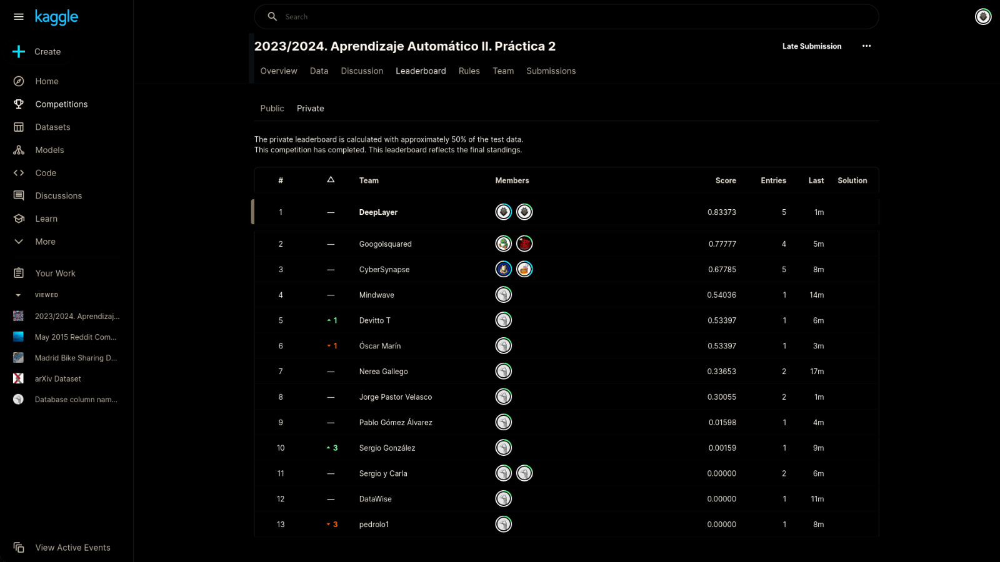

# captcha_competition
Code for the Kaggle captcha competition for the course Machine Learning II.

The objective of the competition is to solve captchas using machine learning techniques. The competition was hosted on Kaggle. It was
divided into two phases:

1. **Experimentation, and code preparation.** In this phase,
some images were released to the participants to experiment with. One challenge, though, was that every captcha started with zero. So, it was not reliable data to train a model with.

Example of the captchas from the first phase:


2. **Competition.** It took place during the class and had a two-hour duration. In this phase, the participants were given a set of new captchas to solve. The competition was based on the accuracy of the predictions, every character in the captcha had to be correctly predicted to be considered a correct prediction. An additional challenge was that the captchas, now, included also letters. Moreover, they were rotated, each character had different colors and fonts, and they were bigger.


## Results: 1st Position! 🏆



### Team Members
- Pablo Ariño
- Álvaro Laguna
- Carlota Medrano

Team Name: **DeepLayer**

## Our Approach: Best Submission

### Model Architecture
During the preparation phase, we pre-trained a Convolutional Vision Transformer on a synthetic dataset of captchas (1M images), with the following architecture:

```
 ===============================================================================================
   Layer (type:depth-idx)                        Output Shape              Param #
   ===============================================================================================
   ResNetTransformer                             [1, 6, 10]                593,792
    ├─Conv2d: 1-1                                 [1, 64, 32, 96]           9,408
    ├─BatchNorm2d: 1-2                            [1, 64, 32, 96]           128
    ├─MaxPool2d: 1-3                              [1, 64, 16, 48]           --
    ├─Sequential: 1-4                             [1, 256, 2, 6]            --
   │    └─ResNetBlock: 2-1                       [1, 64, 8, 24]            --
   │    │    └─Conv2d: 3-1                       [1, 64, 8, 24]            36,864
   │    │    └─BatchNorm2d: 3-2                  [1, 64, 8, 24]            128
   │    │    └─Conv2d: 3-3                       [1, 64, 8, 24]            36,864
   │    │    └─BatchNorm2d: 3-4                  [1, 64, 8, 24]            128
   │    │    └─Sequential: 3-5                   [1, 64, 8, 24]            4,224
   │    └─ResNetBlock: 2-2                       [1, 64, 8, 24]            --
   │    │    └─Conv2d: 3-6                       [1, 64, 8, 24]            36,864
   │    │    └─BatchNorm2d: 3-7                  [1, 64, 8, 24]            128
   │    │    └─Conv2d: 3-8                       [1, 64, 8, 24]            36,864
   │    │    └─BatchNorm2d: 3-9                  [1, 64, 8, 24]            128
   │    │    └─Sequential: 3-10                  [1, 64, 8, 24]            --
   │    └─ResNetBlock: 2-3                       [1, 128, 4, 12]           --
   │    │    └─Conv2d: 3-11                      [1, 128, 4, 12]           73,728
   │    │    └─BatchNorm2d: 3-12                 [1, 128, 4, 12]           256
   │    │    └─Conv2d: 3-13                      [1, 128, 4, 12]           147,456
   │    │    └─BatchNorm2d: 3-14                 [1, 128, 4, 12]           256
   │    │    └─Sequential: 3-15                  [1, 128, 4, 12]           8,448
   │    └─ResNetBlock: 2-4                       [1, 128, 4, 12]           --
   │    │    └─Conv2d: 3-16                      [1, 128, 4, 12]           147,456
   │    │    └─BatchNorm2d: 3-17                 [1, 128, 4, 12]           256
   │    │    └─Conv2d: 3-18                      [1, 128, 4, 12]           147,456
   │    │    └─BatchNorm2d: 3-19                 [1, 128, 4, 12]           256
   │    │    └─Sequential: 3-20                  [1, 128, 4, 12]           --
   │    └─ResNetBlock: 2-5                       [1, 256, 2, 6]            --
   │    │    └─Conv2d: 3-21                      [1, 256, 2, 6]            294,912
   │    │    └─BatchNorm2d: 3-22                 [1, 256, 2, 6]            512
   │    │    └─Conv2d: 3-23                      [1, 256, 2, 6]            589,824
   │    │    └─BatchNorm2d: 3-24                 [1, 256, 2, 6]            512
   │    │    └─Sequential: 3-25                  [1, 256, 2, 6]            33,280
   │    └─ResNetBlock: 2-6                       [1, 256, 2, 6]            --
   │    │    └─Conv2d: 3-26                      [1, 256, 2, 6]            589,824
   │    │    └─BatchNorm2d: 3-27                 [1, 256, 2, 6]            512
   │    │    └─Conv2d: 3-28                      [1, 256, 2, 6]            589,824
   │    │    └─BatchNorm2d: 3-29                 [1, 256, 2, 6]            512
   │    │    └─Sequential: 3-30                  [1, 256, 2, 6]            --
   ├─Conv2d: 1-5                                 [1, 128, 1, 6]            65,664
   ├─TransformerEncoder: 1-6                     [1, 6, 128]               --
   │    └─ModuleList: 2-7                        --                        --
   │    │    └─TransformerEncoderLayer: 3-31     [1, 6, 128]               593,024
   │    │    └─TransformerEncoderLayer: 3-32     [1, 6, 128]               593,024
   ├─Linear: 1-7                                 [1, 6, 10]                1,290
   ├─LogSoftmax: 1-8                             [1, 6, 10]                --
   ===============================================================================================
   Total params: 4,633,802
   Trainable params: 4,633,802
   Non-trainable params: 0
```

Its configuration file is [resnet-transformer-6.yaml](config/resnet-transformer-6.yaml).

For the script that generated the synthetic dataset, please take a look at the [generate_captcha.py](captcha_competition/data/generate_captcha.py) file. The script with the model architecture is [resnet_transformer.py](captcha_competition/pytorch_model/resnet_transformer.py).

### Preprocessing
One important detail is that, to help the model, we preprocessed the images by removing the background, and the image was resized from 80x200 to 64x192. The resizing was done so that the last layer of the model could be a multiple of 6, which is the number of characters in the captcha.

The resulting images looked like this:


## Pre-training
We trained for a total of 1117 epochs, each epoch consisted of 5 batches of 64 images. The model was trained using the AdamW optimizer with a learning rate of 0.0001. The loss function used was the negative log-likelihood loss, applied to the model's output. We kept the best model weights based on the validation accuracy, which happened at epoch 390, with an accuracy of 87.1%.

Relevant script:
- [train.py](captcha_competition/train.py)

## Fine-tuning

During the competition, we fine-tuned the model using the new captchas. We used the same optimizer (with the same state too) and loss function as in the pre-training phase. However, we had to change the final layer of the model to have 13 outputs to account for the new characters ("a", "e" and "u"). The best model weights were kept based on the validation accuracy too, which, in this case, happened at epoch 10, with an accuracy of around 0.92.

Applying, the same preprocessing, we fine-tuned the model for 5 epochs since the training dataset only had 10,000 images and we reached nearly 100% accuracy in training. The best model weights were kept based on the validation accuracy, which happened at epoch 4, with an accuracy of around 95.4%. 

Using a pre-trained model was critical to compensate for the lack of data. Without undergoing fine-tuning, the same model achieved an accuracy of only 54% on the test dataset.

Relevant scripts:
- [finetune.py](captcha_competition/finetune.py)
- [submit_from_config.py](captcha_competition/submit_from_config.py)


## Project structure
The project structure is based on the [Cookiecutter Data Science](https://drivendata.github.io/cookiecutter-data-science/) template.

Main details of the project structure:
- Notebooks are used for exploratory data analysis, prototyping, visualizations, and debugging.
- The `captcha_competition` directory contains the source code, and some scripts to run the training and evaluation of the models.
- The `data` directory contains the raw and processed data.
- The `models` directory contains the trained models.
- Hyperparameters and configurations are stored in the `config` directory as `.yaml` files.

## Installation

1. Install [poetry](https://python-poetry.org/docs/):

```bash
pip install poetry==1.7.1
```

2. Create a virtual environment:

```bash
poetry shell
```

3. Install the dependencies:

```bash
poetry install
```

For adding new dependencies, use:

```bash
poetry add <package>
```

###  Note
Remember to change the environment path to your computer.


